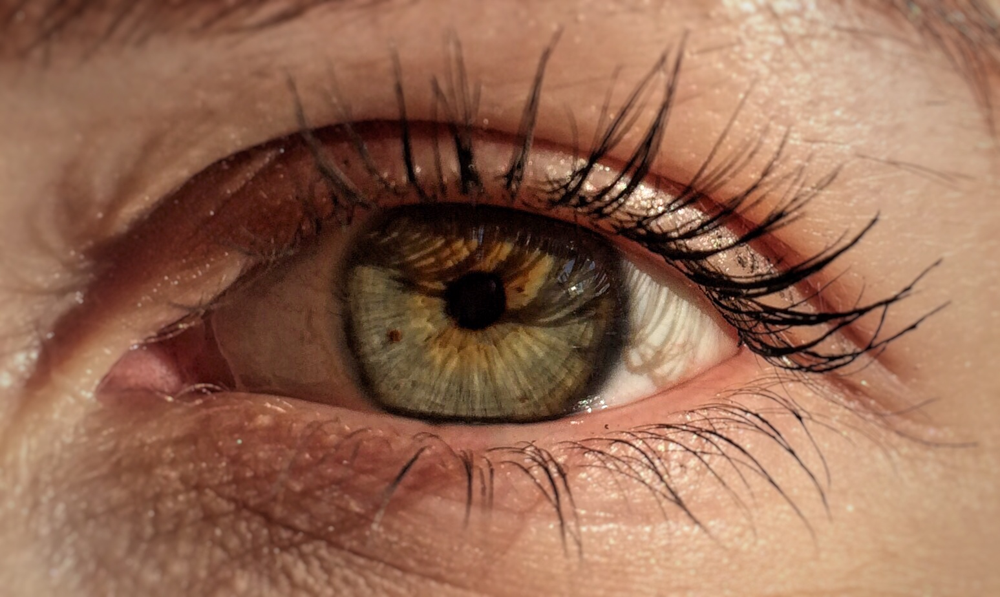

## iris-form

Author: Nasanbayar Ulzii-Orshikh

Date: 12/13/2019

Description: this project is a full implementation of a Convolutional Neural Network from scratch, trained on a sample
from a human iris data set that I have been "collecting" for the last 5 years. Since the first time I saw "I Origins", I have been
obsessed by the beauty and uniqueness of iris patterns, taking pictures of my friends' eyes, and just as how the film
shows some neural network finding a match for a reincarnated soul, I finally had a chance and skill to develop my own
neural network thanks to my Linear Algebra class.

Here is probably my favorite shot -- the iris pattern of Anastasiya Bukryeyeva's left eye, January 11, 2016.

